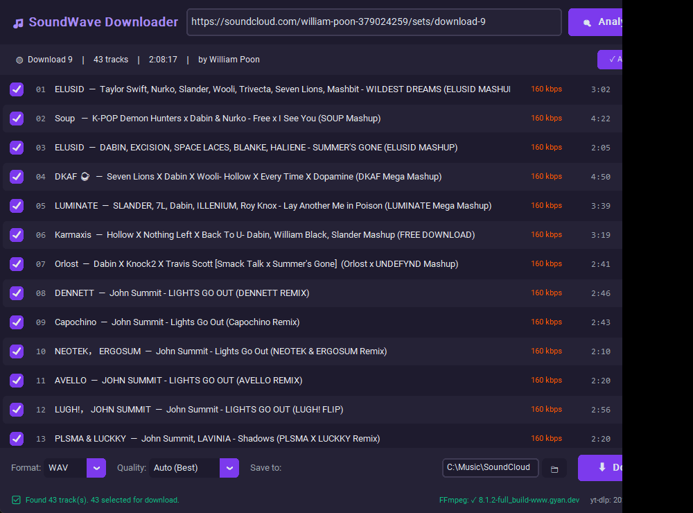
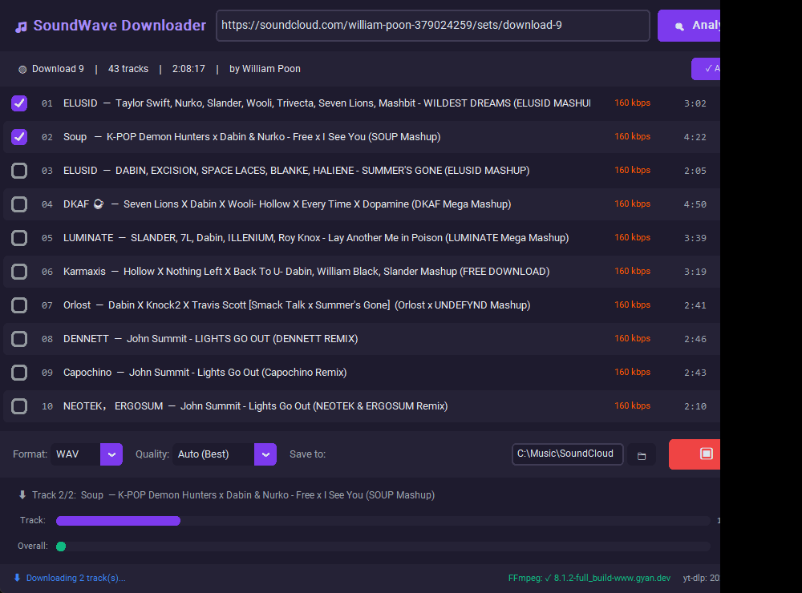
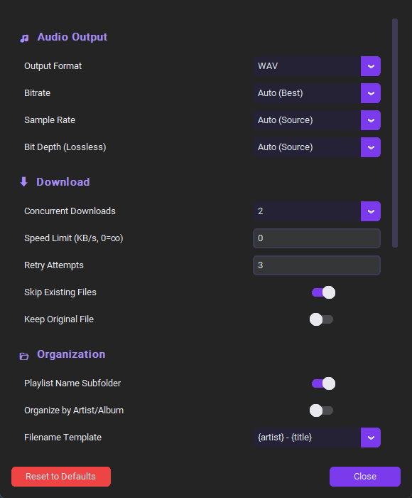

# 🎵 SoundWave Downloader

A modern Windows desktop app for downloading **SoundCloud** and **YouTube** playlists or single tracks as high-quality audio files (WAV, MP3, FLAC and more), with a clean dark UI, smart quality selection, and automatic recovery from rate limiting.



## Features

- **Playlists & single tracks** — paste any SoundCloud set/track or YouTube playlist/video URL
- **Fast playlist analysis** — track list appears with live progress; metadata is fetched in parallel
- **9 output formats** — MP3, WAV, FLAC, OGG, AAC, OPUS, M4A, AIFF, WMA
- **Smart quality** — bitrate matched to the source (or fixed 128–320 kbps), sample rate and bit depth control for lossless formats (16/24/32-bit)
- **Playlist subfolders** — each playlist downloads into its own folder named after the playlist, e.g. `Downloads\Soundcloud tracks\Download 9\`
- **Concurrent downloads** — 1–5 tracks at once with per-track and overall progress
- **Rate-limit auto-recovery** — if SoundCloud temporarily blocks requests (HTTP 403/429), all workers pause together and retry with backoff instead of failing the rest of the playlist
- **Metadata & cover art** — tags (artist, title, album, genre, date) embedded automatically; album art embedded where the format supports it
- **Resilient by design** — skip-existing files, per-track retries, socket timeouts, duplicate-filename protection, and a stall watchdog so the app never hangs forever
- **Extras** — volume normalization (EBU loudnorm), artist/album folder organization, filename templates, download speed limit, proxy support, browser cookies for restricted YouTube content

## Screenshots

Downloading with live progress:



All settings:



## Requirements

- **Windows 10/11**
- **[FFmpeg](https://ffmpeg.org/download.html)** — required for audio conversion. Easiest install:
  ```
  winget install ffmpeg
  ```
- **Python 3.11+** (only if running from source — the packaged `.exe` includes everything else)

## Run from source

```
git clone https://github.com/AverageEnyineer98/Soundcloud-Youtube-playlist-downloader.git
cd Soundcloud-Youtube-playlist-downloader
pip install -r requirements.txt
python main.py
```

## Build a standalone .exe

```
python build.py
```

The single-file executable is written to `dist\SoundWave Downloader.exe`. Notes:

- FFmpeg is not bundled by default — install it on the target machine, or place `ffmpeg.exe` in an `ffmpeg\` folder next to `build.py` before building to embed it.
- The packaged exe pins its bundled `yt-dlp` version. If SoundCloud/YouTube change their sites and downloads start failing, rebuild to pick up the latest `yt-dlp`. (When running from source, the app auto-updates `yt-dlp` on launch.)

## Usage

1. Paste a SoundCloud or YouTube URL into the top bar and click **Analyze**
2. Untick any tracks you don't want
3. Pick a format (e.g. WAV) and quality, choose the save folder
4. Click **Download** — each playlist is saved into its own subfolder

If you see *"Rate limited by SoundCloud — waiting…"*, that's normal on large playlists: the app pauses, waits out the block, and finishes the job by itself.

## Settings

Click the ⚙ gear for all options: output format/bitrate/sample rate/bit depth, concurrent downloads, speed limit, retries, playlist subfolders, artist/album organization, filename templates, album art, volume normalization, theme, proxy, and browser cookies.

Settings are stored in `%USERPROFILE%\.soundwave_downloader\settings.json`.

## Disclaimer

This tool is intended for downloading content you have the right to download — your own uploads, tracks marked free-to-download by their creators, and other legitimately licensed audio. Respect the terms of service of SoundCloud/YouTube and the rights of artists.
